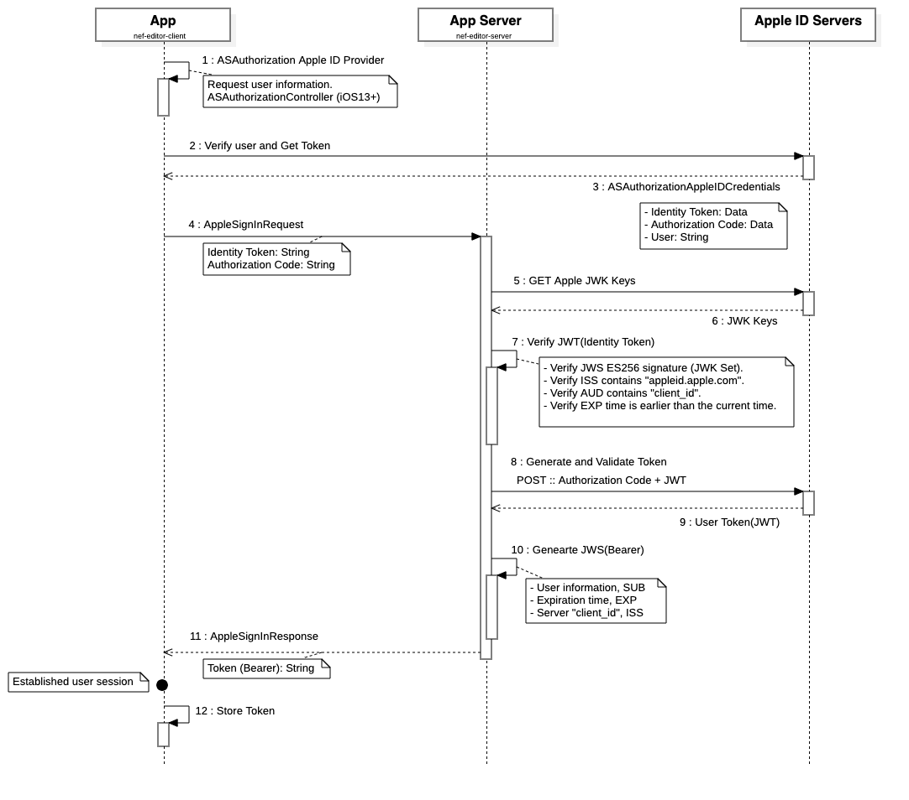

# 🖥  nef editor

## 🔌 APIs

### Sign-in
Sign in to nef using their Apple ID. You can consume this service using [Bow OpenAPI](openapi.bow-swift.io) and the schema at `NefEditorSchema`.
You can read more about how sign-in works in the [How to Sign-in into nef?](#-how-to-sign-in-into-nef) section.

#### Request
- **POST** /signin
- **Accept** application/json
- **Content-Type** application/json
- **Body** AppleSignInRequest

#### Response
- **Content-Type** application/json
- **Body** AppleSignInResponse

&nbsp;

## 🗝 How to Sign-in into nef?

Apple announced in 2019 a new feature, "Sign In with Apple" enabling users to sign in to apps using their Apple ID. Apple positioned this feature as a fast, secure, and privacy-friendly way for users to set up an account and start using your apps. It sounds like a great solution for our app to enable **authorized services** without having to rely on external identity providers.

### Client
1. Users will use Apple provider, and they will sign in using their two-factor authentication Apple ID (Face ID or Touch ID on passcode-protected devices).
2. Users grant/deny permissions that application requested.
3. Apple ID servers direct users back to the application, along with a token. This token contains identity token (JWT) and an authorization code, between other user's information.
4. The application then uses this user's information to sign-in; the client will send **AppleSignInRequest**.

### Backend
1. Using the JWT and the authorization code (AppleSignInRequest), received from the client, it will be used to retrieve information from Apple ID servers.
2. App server will verify the JWT (identity token) received.
   - Verify the JWS E256 **signature** using the server's public key.
   - Verify that the **iss** field contains https://appleid.apple.com.
   - Verify that the **aud** field is the developer's client_id.
   - Verify that the **time** is earlier than the exp value of the token.
3. Using the **authorization code** received from the client, and the **verified JWT**, app server will retrieve user's information from Apple ID servers.
4. App server uses received user's information to sign-in, and come back to the client, **AppleSignInResponse**.

### Sequence Diagram

    

