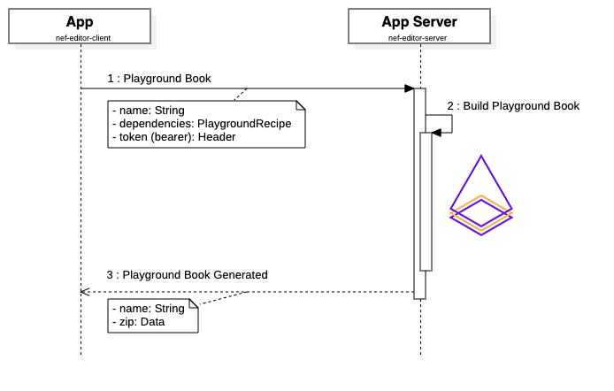

<p align="center">


</p>

Welcome to server-side for nef Playgrounds!

It provides the services for [nef client](https://github.com/bow-swift/nef-editor-client). In the next lines, you will find information about APIs specification, how nef has integrated Apple Sign-in, and how does it generate a Playground Book.

It is a project that mixes a lot of technologies to run Swift in the backend.
- [**Vapor**](https://vapor.codes/): a Framework for Server-side Swift that runs on macOS and **Ubuntu**.
- [**Bow**](https://bow-swift.io/): a cross-platform library for Typed **Functional Programming** in Swift.
- [**nef**](https://nef.bow-swift.io): a lot of cool features for Playgrounds; in particular, it lets us build a **Playground Book** with external dependencies defined in a Swift Package.
- [**Bow OpenAPI**](https://openapi.bow-swift.io): auto generate **functional HTTP clients** given an OpenAPI specification. It lets us create a network client for Apple APIs.

&nbsp;


## 🗝 How to Sign-in with nef?

Apple announced in 2019 a new feature, *Sign In with Apple*, enabling users to sign in to apps using their Apple ID. Apple presented this feature as a fast, secure, and privacy-friendly way for users to set up an account and start using your apps. It sounds like a great solution for our app to enable **authorized services** without having to rely on external identity providers.

### Client
1. Users will use Apple authentication services, and they will sign in using their Apple ID account (using Face ID or Touch ID on passcode-protected devices).
2. Users grant/deny permissions requested by the application.
3. Apple ID servers returns users back to the application, along with a token. This token contains an identity token (JWT) and an authorization code, together with additional user information.
4. The application then uses this user's information to sign-in; the client will send an **AppleSignInRequest**.

### Backend
1. Using the JWT and the authorization code, received from the client, it will retrieve information from Apple ID servers.
2. App server will verify the received JWT (identity token).
   - Verify the JWS E256 **signature** uses Apple's public key.
   - Verify that the **iss** field contains `https://appleid.apple.com`.
   - Verify that the **aud** field is the developer's `client_id`.
   - Verify that the **time** is earlier than the expiration time of the token.
3. Using the **authorization code** received from the client, and the **verified JWT**, app server will retrieve user's information from Apple ID servers.
4. App server uses received user's information to sign-in, and come back to the client, returning an **AppleSignInResponse**.


<details>
<summary>📣 Sequence Diagram</summary>
<p align="center">
    
</p>
</details>

&nbsp;


## ⚙️ How to generate a Playground Book?

nef has been migrated to FP and modularized in [version 0.6](https://github.com/bow-swift/nef/releases/tag/0.6.0); we can use it as a library and take advantage of its features in the backend. We will focus on the functionality to create a [Playground Book](https://github.com/bow-swift/nef#-creating-a-playground-book) with external dependencies given a Swift Package.

### Client
1. Users must be authenticated, use the **token** received after Sign In with Apple.
2. Users sends a list of Swift dependencies.

### Backend
1. The application validates the received token.
   - Verify the **signature** using the server's public key.
   - Verify that the **iss** field contains the `client_id`.
   - Verify that the **time** is earlier than the expiration date of the token.
2. Build the Playground Book using nef, and return it compressed to the client.

<details>
<summary>📣 Sequence Diagram</summary>
<p align="center">
    
</p>
</details>

&nbsp;


## 📲 How to deploy?

This app server has been dockerized so that you can run the application within a Docker container. It uses the official Apple's docker image for Swift 5.2, running in Ubuntu 18.04.

```bash
docker build -t nef-playgrounds:latest .
docker run --env-file <environment path> --rm -p 8080:8080 -it nef-playgrounds:latest
```

> Read "Secrets" section for more information about how to setup environment variables.

### Secrets
[Vapor 4](https://docs.vapor.codes/4.0/environment/) has added support for `.env` files; it lets us share secrets with our Vapor application, and configure the app server dynamically, making it easy to configure environment variables without needing to set them manually.

This application needs the following secrets to work:
- **p8Key**: private key for client authentication. A key generated by the WWDR portal, and associated to your app identifier.
- **keyId**: key ID of private key for client authentication.
- **teamId**: your Apple Team ID.
- **clientId**: the application identifier for your app; it is the client's bundle ID.
- **redirectURI**: it must include a domain name, and it is associated to your app identifier (under the *Sign In with Apple* capability) in the WWDR portal.
- **publicRS256Key**: public key used to validate the signature for received JWT (using RSA Signature with SHA-256 asymetric algorithm).
- **privateRS256Key**: private key used to sign generated client JWT (using RSA Signature with SHA-256 asymetric algorithm).

You can create public/private key pair for signing/validating JWT, running:
```bash
ssh-keygen -t rsa -b 4096 -m PEM -f jwtRS256.key
openssl rsa -in jwtRS256.key -pubout -outform PEM -out jwtRS256.key.pub
```

&nbsp;


## APIs

### 🔌 Sign-in
Sign in to nef using their Apple ID. You can consume this service using [Bow OpenAPI](https://openapi.bow-swift.io) and the schema at `NefEditorSchema`.

##### Request
- **POST** /signin
- **Accept** application/json
- **Content-Type** application/json
- **Body** AppleSignInRequest

##### Response
- **Content-Type** application/json
- **Body** AppleSignInResponse

> You can read more about how sign-in works in [How to Sign-in into nef?](#-how-to-sign-in-into-nef)

### 🔌 Generate Playground Book
Generates a Playground Book given a recipe.

##### Request
- **POST** /playgroundBook
- **Accept** application/json
- **Content-Type** application/json
- **Authorization** Bearer
- **Body** PlaygroundRecipe

##### Response
- **Content-Type** application/json
- **Body** PlaygroundBookGenerated

> This repo provides `NefEditorData` module in order to keep the models for request/response in sync between frontend and backend.

&nbsp;


## ❤️ Contributing to the project

You can contribute in different ways to make `nef Playgrounds` better:

- File an issue if you encounter a bug or malfunction.
- Open a Pull Request fixing a problem or adding new functionality. You can check the [Issues](https://github.com/47deg/nef-editor-server/issues) to see some of the pending tasks.
- Discuss with us in the [Gitter channel for Bow](https://gitter.im/bowswift/bow) about all the above.

### How to run the project

1. Go to project folder and run:
```bash
make xcode
```
It will generate HTTP clients, will resolve the dependencies and will generate the Xcode project.

2. Open `nef-editor-server.xcodeproj` in Xcode 11 (or newer) and you are ready to go.

> You need to install [Bow OpenAPI](https://openapi.bow-swift.io/) to generate the HTTP clients that the project needs to work.

&nbsp;


## ⚖️ License

    Copyright (C) 2020-2021 The nef Authors

    Licensed under the Apache License, Version 2.0 (the "License");
    you may not use this file except in compliance with the License.
    You may obtain a copy of the License at

       http://www.apache.org/licenses/LICENSE-2.0

    Unless required by applicable law or agreed to in writing, software
    distributed under the License is distributed on an "AS IS" BASIS,
    WITHOUT WARRANTIES OR CONDITIONS OF ANY KIND, either express or implied.
    See the License for the specific language governing permissions and
    limitations under the License.
